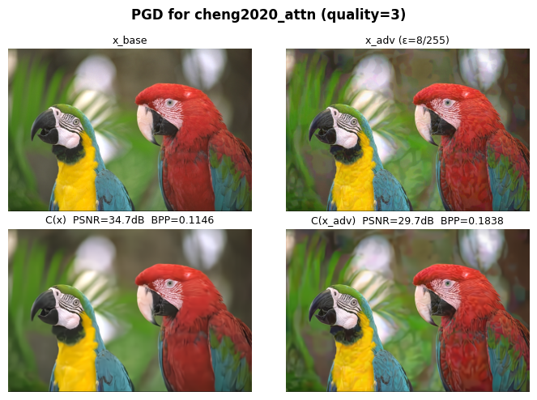
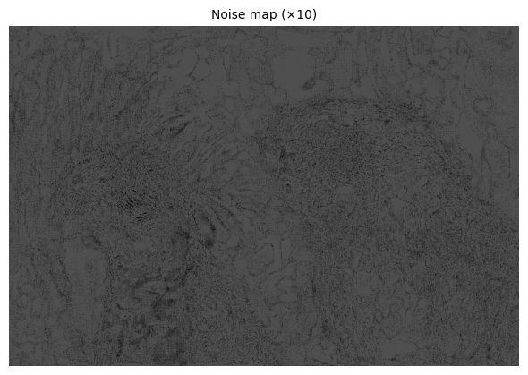
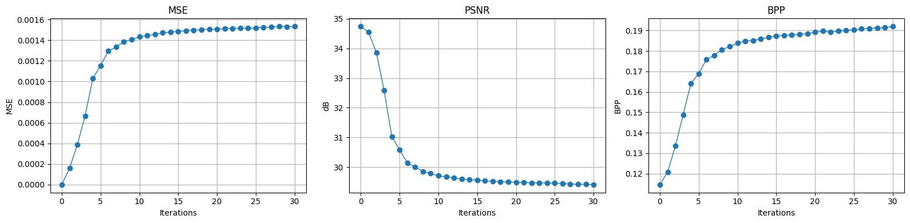

# PGD Attack for Cheng2020 Neural Codec

## Overview

We discover how a small adversarial perturbation can significantly change the output of a neural image codec while remaining visually imperceptible on the input image. We attack the pretrained Cheng2020 attention-based codec from `compressai`.

## Problem statement

Let:

- $x \in [0,1]^{3 \times H \times W}$ be the original image,
- $C(\cdot)$ be the codec,
- $\delta$ be an adversarial perturbation,
- $\|\delta\|_\infty \le \varepsilon$.

The goal of the attack is to maximize the discrepancy between the codec outputs for the clean and perturbed inputs:

$$
\delta^\* = \arg\max_{\|\delta\|_\infty \le \varepsilon}
\operatorname{MSE}\bigl(C(x), C(x+\delta)\bigr)
$$

The adversarial image is then clipped to the valid pixel range:

$$
x_{\text{adv}} = \operatorname{clip}_{[0,1]}(x+\delta^\*)
$$

## PGD update rule

At iteration $t$, PGD performs a gradient step and then projects back into the allowed $\varepsilon$-ball:

$$x_{t+1} = \Pi_{B_\infty(x,\varepsilon)} \left( x_t - \alpha \cdot \operatorname{sign}\left(\nabla_{x_t} \mathcal{L}(x_t)\right) \right)$$ 

The loss is MSE with a minus

$$
\mathcal{L}(x_t) = -\operatorname{MSE}\bigl(C(x), C(x_t)\bigr)
$$

so that gradient descent on $\mathcal{L}$ becomes gradient ascent on the codec mismatch.

## Metrics

### PSNR

Peak Signal-to-Noise Ratio between the original image and the reconstructed image:

$$
\mathrm{PSNR}(x,\hat{x}) = 10 \log_{10}\left(\frac{1}{\mathrm{MSE}(x,\hat{x})}\right)
$$

Higher is better.

### BPP

Bits Per Pixel, estimated from the likelihoods returned by the codec:

$$
\mathrm{BPP} = -\frac{1}{HW}\sum \log_2(p)
$$

Lower is better for compression, but adversarial examples can increase BPP by making the image harder to encode.

## Results

Typical output for the reference experiment:

| Metric | Baseline $C(x)$ | After attack $C(x_{\mathrm{adv}})$ | Delta |
|---|---:|---:|---:|
| PSNR (dB) | 34.74 | 29.70 | -5.04 |
| BPP | 0.1146 | 0.1838 | +0.0693 |

The attack reduces reconstruction quality and also makes the codec less efficient: PSNR drops by more than 5 dB, while BPP increases. That means the adversarial perturbation is small in pixel space, but it makes the codec spend more bits on the same image structure.

### Kodak parrots



The adversarial input remains visually close to the original, but the reconstructed output shifts noticeably, which is the main effect of the attack.

### Noise map



The noise map shows where the perturbation concentrates. The strongest changes cluster around semantically important and high-frequency regions, such as feathers, eyes, and object boundaries.

### Metrics



The metric curves show the attack dynamics as the number of PGD iterations grows. MSE increases with more steps, PSNR decreases accordingly, and BPP rises. Convergence means that attack abilities are limited by the size of the $\epsilon$ sphere.

## References

If you find this project useful, cite it as:

```bibtex
@misc{cheng2020_pgd_attack,
  author       = {Zyukov, Alexey},
  title        = {PGD Attack for Cheng2020 Neural Codec},
  year         = {2026},
  publisher    = {GitHub},
  howpublished = {\url{https://github.com/pymlex/pgd-cheng2020}},
}
```

The project is under GPL-3.0.
